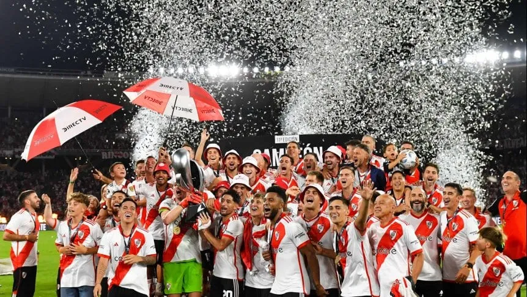

<!DOCTYPE html>
<html lang="es">
    <head>
        <meta charset="UTF-8">
        <meta name="viewport" content="width=device-width, initial-scale=1.0">
        <title>River Hoy: Mensaje del hijo de Enzo Pérez, la frase de Brito sobre Demichelis y últimas noticias - TyC Sports</title>
        <link rel="stylesheet" type="text/css" href="./styles.css">
    </head>

<body>

        <header>
        
            <h1 class="title">
            River hoy: el fuerte apoyo de brito a Demichelis, el mensaje del hijo de Enzo Pérez tras la supercopa Argentina y últimas noticias
            </h1>
    
        

    
    <a>15/03/2024 03:46 pm</a>
    <a href="https://www.tycsports.com/river-plate/river-hoy-ultimas-noticias-minuto-a-minuto-id571050.html">River Hoy</a>
    <a href="https://www.tycsports.com/champions-league/sorteo-champions-league-cuartos-de-final--id571043.html">Champions League</a>
    <a href="https://www.tycsports.com/europa-league/con-finalista-argentino-asegurado-el-sorteo-de-la-europa-league-id571054.html">Europa League</a>
    <a href="https://www.tycsports.com/seleccion-argentina/seleccion-argentina-inter-miami-lesion-lionel-messi-gira-estados-unidos-id571213.html">Lionel Messi</a>
    
        

        
        </header>

        <main>
            <section>
                
 
                    Conocé las últimas noticias de River y todas las novedades de hoy, viernes 15 de marzo. Tras la consagración contra Estudiantes, el Millonario ya piensa en el choque con Gimnasia.
                

                <article class = "fotoytexto">
                    
                    
                        Títulares de River ante Estudiantes de la plata:
                        
                        <ul>
                            <li>1. Franco Armani</li>
                            <li>20. Milton Casco</li>
                            <li>17. Paulo Díaz</li>
                            <li>14. Leandro González Pírez</li>
                            <li>2. Sebastián Boselli</li>
                            <li>5. Matías Kranevitter</li>
                            <li>26. Ignacio Fernández</li>
                            <li>11. Facundo Colidio</li>
                            <li>21. Ezequiel Barco</li>
                            <li>36. Pablo Solari</li>
                            <li>9. Miguel Borja</li>
                        </ul>
                    
                </article>
                    
                        Foto: (Hernan Cortez/Getty Images).
                    
                    

                

                <article>
                    

                        <h1 class="title">
                        Conocé las últimas noticias de River y todas las novedades de hoy, viernes 15 de marzo.
                        </h1>
                        
                        

                        El Millonario le ganó 2-1 a Estudiantes de La Plata en el estadio Mario Alberto Kempes, con un gol en contra de Zaid Romero y un golazo agónico de Rodrigo Aliendro, y se consagró campeón de la Supercopa Argentina en Córdoba. Jorge Brito le dio su apoyo a Martín Demichelis para que sea el DT hasta el final de su mandato. Ahora, el plantel ya piensa en el partido con Gimnasia del domingo.
                        

                    

                </article>                  
            </section>
        </main>
    

<footer>
    

        

        TyC Sports © de Tele Red Imagen S.A. 2022
        | Contactanos y más!
        

    

    <a href="https://www.facebook.com/tycsports">Facebook</a>
    <a href="https://twitter.com/tycsports">Twitter</a>
    <a href="https://www.instagram.com/tycsports/">Instagram</a>
    <a href="https://www.youtube.com/user/TyCSportsOficial">Youtube</a>
</footer>

</body>

</html>
